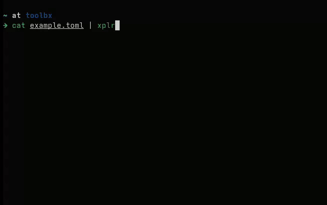

<p align="center"></p>

---

[](https://github.com/CrosleyZack/xplr/blob/main/LICENSE)
[](https://github.com/crosleyzack/xplr/releases)
[](https://github.com/crosleyzack/xplr/actions?workflow=gotest)

Xplr allows you explore tree-based file formats as an interactive TUI tree. This currently supports JSON, YAML, and TOML files.

</p>


## Installation

Can be installed using Go 1.23+ via:

```bash
go install github.com/crosleyzack/xplr@latest
```

## Examples

Xplr can take in data by providing a data file:

```bash
xplr -f foo.toml
```

or by passing it as the first argument:

```bash
xplr "{\"foo\": \"bar\"}"
```

or finally via stdin:

```bash
cat bar.yml | xplr -x 1
```

## Configuration

Xplr will search for a configuration toml file at:

1. $XPLR_CONFIG
2. $XDG_CONFIG_HOME/xplr/config.toml

Configuration options include:

```toml
# format
ExpandShape = "╰─"
LeafShape = "❂"
SpacesPerLayer = 2
MergedObjectOverride = "" # if set, will not show a merged representation of a nested object
# colors
ExpandShapeColor = "#d99c63"
LeafShapeColor = "#d19359"
SelectedForegroundColor = "#fffffb"
SelectedBackgroundColor = "#63264A"
UnselectedForegroundColor = "#fffffd"
HelpColor = "#fffffe"
# keys
BottomKeys = ["bottom", "G"]
TopKeys = ["top", "g"]
DownKeys = ["down","j"]
UpKeys = ["up","k"]
CollapseToggleKeys = ["tab", "h", "l"]
CollapseAllKeys = ["<", "H"]
ExpandAllKeys = [">", "L"]
HelpKeys = ["?"]
QuitKeys = ["esc","q"]
SearchKeys = ["/"]
SubmitKeys = ["enter"]
NextKeys = ["n"]
```